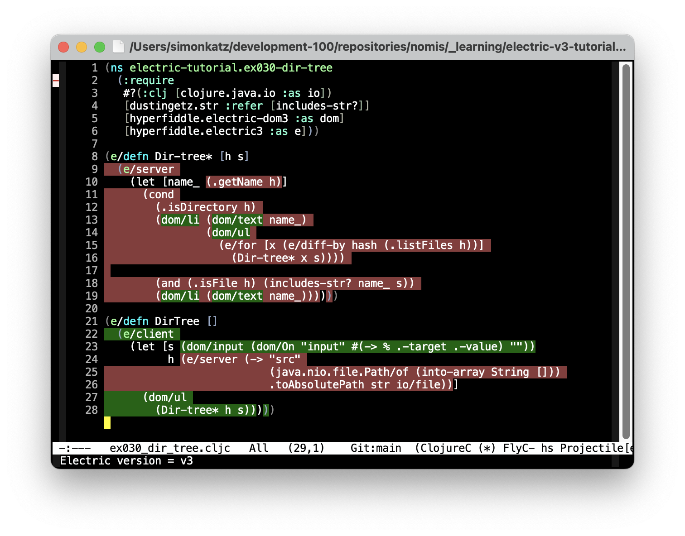

# Introduction

This is an Emacs minor mode for [Electric Clojure](https://github.com/hyperfiddle/electric). It colors client and server sites in source code.

Here's an example (code taken from [dir-tree example at Electric v3 tutorial](https://electric.hyperfiddle.net/tutorial/dir_tree)):


# Installation

To install, copy the file `nomis-electric-clojure.el` to a place where it will be found by your Emacs and add the following to your init file:

```
  (require 'nomis-electric-clojure)
```


# Turning on nomis-electric-clojure-mode

To turn on nomis-electric-clojure-mode, run `M-x nomis-electric-clojure-mode`. The same command will turn it off.


# Overview of Features

nomis-electric-clojure-mode does the following:

- Auto-detects whether the code is Electric v2 or Electric v3. It does this by looking for one of the following near the start of the file:

  - `[hyperfiddle.electric :as e]`
  - `[hyperfiddle.electric3 :as e]`
  - (If auto-detect fails, v3 is assumed.)

- Applies separate colors to client regions and server regions.

- Does not apply a color to regions that may be either client or server.

nomis-electric-clojure-mode does not look at the call tree, so regions of code that are not colored may in fact always run on one site.


# Coloring Initial Whitespace

By default, initial whitespace is not colored.

You can change this by customizing `nomis/ec-highlight-initial-whitespace?`.

You can toggle this on-the-fly with `M-x nomis/ec-toggle-highlight-initial-whitespace?`

Here's an example (code again taken from [dir-tree example at Electric v3 tutorial](https://electric.hyperfiddle.net/tutorial/dir_tree)):




# FAQ

## nomis-electric-clojure-mode thinks code is v2 but actually it's v3, or vice versa

This can happen in a newly-created file or if the if the `:require` form in the namespace declaration is changed.

You can re-run the auto-detection of the version in any of the following ways:

- by running `M-x nomis/ec-redetect-electric-version`

- by turning nomis-electric-clojure-mode off and then back on (by running
  `M-x nomis-electric-clojure-mode` twice)

- by reverting the buffer.


# Remaining Work

For Electric v2 I don't think there's anything further to do.

I still need to finish going through the Electric v3 tutorial, but I think I may want to add understanding of the contents of the `hyperfiddle.electric-forms3` namespace, or at least some of it. I'm not sure if there's anything else that could or should be done.


# Contributing

See [Contribution guidelines for this project](docs/CONTRIBUTING.md).
